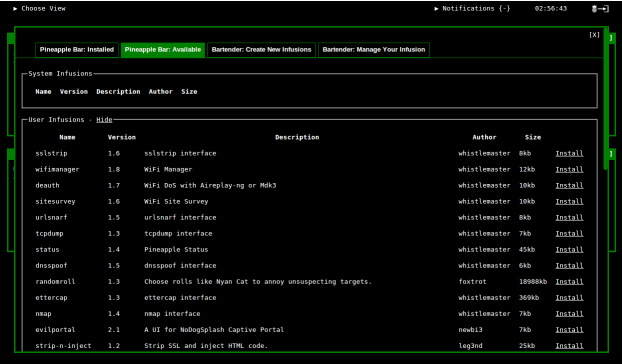

# Web Interface API

## The WiFi Pineapple Mark V Web Interface

The WiFi Pineapple Mark V Web Interface is a dynamic and modular control panel for the WiFi Pineapple. It is mainly made up of modules - known on the Pineapple as infusions. The Web Interface is made up of three major components, listed below.

### The notification bar

The notification bar is located at the top of the Web Interface. It is made up of a notification manager, a clock, the logout button and the view picker. As the name says, the notification bar exists primarily to display notifications to users. Notifications can be sent using either PHP JavaScript or simpily a shell command. More details on this can be found in the API Documentation.


### The small tiles
The small tiles are what make up the main visible portion of the Mark V Web Interface. These are widgets to show the current status of each infusion and / or to provide service toggles. Each tile's title can be click to open the corresponding large tiles. Small tiles should be a small view into the infusion.


### The large tiles

The large tiles are a more in-depth view into each infusion. Large tiles can be used to configure your infusion, view logs or other output, give setup instructions, and much more. Often, the large tile will be divided into tabs to display content in an orderly manner. From firmware version 1.5.0 tabes can be created using a PHP API function.


## WiFi Pineapple Mark V Infusions

The Mark V is expandable through modules, also known as infusions. These modules can be downloaded and installed over-the-air with two clicks from the "Pineapple Bar", a free market place for these modules. Additionally infusions can be created right from the "Pineapple Bar" under the "Bartender" tab. Infusions can be submitted to the [WiFi Pineapple Website](https://wifipineapple.com/) and, if approved, will be available to all Mark V users from the Pineapple Bar.



### Web Interface Infusions

There are three different types of Web Interface Infusions:

+ **Standard Web Interface Infusion**: A standard Web Interface Infusion is the simplest of infusions. See the Web Interface Infusion structure below for more details

+ **Refreshing Web Interface Infusion**: These are the same as standard Web Interface Infusions except that the small tile will refresh every three seconds. This is particularly useful if information is being displayed which is meant to be refreshed. It also means any other code in the small tile is executed every 3 seconds.

+ **Web Interface Infusion with CLI component**: To create a Web Interface Infusion with a CLI component, a normal Web Interface infusion (standard / refreshing) must be created first. Once created, a folder named "executable" must be created inside the root of the infusion. Now, a file named "executable" must be created inside the newly created folder. This file may be an executable of any type the WiFi Pineapple can handle (bash, python, binary executable, etc). It is important to note that the executable file must have executable permissions (`chmod +x`). For more details on CLI infusions and how they work, please see the appropriate section in this document.

### Web Interface Infusion Structure

Web Interface Infusions can be found on the WiFi Pineapple Mark V in the `/pineapple/components/infusions/{Infusion_Name}/` folder.

By default, they are made up of four files:

+ **small_tile.php**
  + Contains the code for the small tile of the infusion.
  + Code can be a mix of HTML, JS, CSS, and PHP.
+ **large_tile.php**
  + Contains the code for the large tile of the infusion.
  + Code can be a mix of HTML, JS, CSS, and PHP.
+ **functions.php**
  + This PHP file should house your PHP functions which you want to use in your infusion.
  + This should be the place you submit any GET or POST requests (using AJAX) to from your large or small tiles.
+ **handler.php**
  + This PHP file is automatically generated and should not be modified unless the infusion version is being changed. This is currently the only way to increment the infusion version and is therefore required when the infusion is being submitted to the WiFi Pineapple Bar through the [WiFi Pineapple Website](https://wifipineapple.com/).

### CLI Only Infusions

CLI Only Infusions do not have a Web Interface frontend. Rather, they are extensions to the WiFi Pineapple CLI. These type of Infusions are executed by executing "pineapple infusion {infusion_name}" over the command line.

The general structure of a CLI infusion is as follows:

+ **cli_handler.php**
  + This file is automatically generated and should not be modified unless the infusion version is being changed. This is currently the only way to increment the infusion version and is therefore required when the infusion is submitted to the WiFi Pineapple Bar through the [WiFi Pineapple Website](https://wifipineapple.com/).
+ **executable/executable**
  + This file is where the actual infusion lives. It may be in the form of an interpreted executable (bash, php, python) or a binary executable. In the case of an interpreted executable, the first line of this file must use a shebang to point to the interpreter, for example `#!/usr/bin/python`.

## WiFi Pineapple CLI

The WiFi Pineapple CLI is the Command Line Interface equivalent to the Web Interface providing the ability to start, stop and configure services. It is designed with a modular approach similar to the Web Interface allowing users to control certain aspects of the installed Infusions.

## PHP API Functions

The PHP API is accessible from any PHP file on the Mark V. To initiate it, simply use the following code snippet:

```php
namespace pineapple;
$pineapple = new Pineapple(__FILE__);
```

This will set a variable named "$pineapple" up to be with the Pineapple API object. Following this is a list of all variables and functions associated with this API object.

```php
/**
 *The current absolute directory
 */
 $pineapple->directory


/**
 *The current relative directory to the
 *WiFi Pineapple Web Interface
 */
 $pineapple->rel_dir


/**
 *Function to check if they WiFi Pineapple
 *Is currently online
 *@return boolean Online status
 */
 $pineapple->online()


/**
 *Function to check if USB storage is available.
 *@return boolean USB availability
 */
 $pineapple->usbAvailable()


/**
 *Function to check if SD storage is available.
 *@return boolean SD availability
 */
 $pineapple->sdAvailable()


/**
 *Function to get the WiFi Pineapple firmware version
 *@return string Version in the form X.X.X
 */
 $pineapple->getVersion()


/**
 *Function to check if a firmware version higher or equal
 *to the one required is installed.
 *@param string $version Firmware version required (X.X.X)
 *@return boolean     Required firmware Present
 */
 $pineapple->requireVersion($version)


/**
 * Function to execute a command in a
 * non­blocking manner.
 * @param string $command The command to execute
 */
 $pineapple­>execute($command)


/**
 * Function to install a package or a list of packages.
 * @param string/array $pkg_or_array Package name or array of package names
 * @param string $destination optional: 'internal' or 'sd'
 * @return boolean Successful initiation of package install
 */
 $pineapple­>installPackage($pkg_or_array, $destination = "internal")


/**
 *Function to check if a package or an array of packages is
 *present on the Mark V system.
 *@param string/array $pkg_or_array Package name or array of pacakge names
 *@return boolean
 */
 $pineapple->checkPackage($pkg_or_array)


/**
 * Function to verify that a given password
 * is the correct password for the WiFi Pineapple.
 * @param string $password Password to verify
 * @return boolean correct
 */
 $pineapple-­>verifyPassword($password)


/**
 * Function to send a notification
 * @param string $notification The notification to be sent
 * @return null
 */
 $pineapple­->sendNotification($notification)


/**
 * Function to draw tabs on the large tile.
 * This function will automatically create
 * the file and directory structure required.
 * see /pineapple/components/infusions/{name}/tabs
 * @param array $tabs An array of tabs to draw
 */
 $pineapple­->drawTabs(array $tabs)
```

## JavaScript API Functions

The JavaScript API is accessible from any small or large tile (and any included content therein). There is no need to initialize this API as the following functions are declared globally throughout the Web Interface.

```javascript
/**
 * Function to send a notification
 * @param {string} message The notification text
 * @param {string} sender optional: infusion name
 * @param {string} color optional: highlight color
 */
 notify(message, sender, color)


/**
 * Refreshes the small tile of an infusion
 * given it's name.
 * @param {string} name Name of the infusion
 * @param {string} type optional: only for system infusions
 */
 refresh_small(name, type)


/**
 * Creates a popup with a given message.
 * The message may contain html, javascript,
 * and css.
 * @param {string} message Message to popup
 */
 popup(message)


/**
 * jQuery function to send any form over AJAX.
 * This function must be called in the form
 * of $(this).AJAXifyForm(callback_function).
 * @param {function} funct A JS function to call after completition.
 */
 AJAXifyForm(funct)
```

Tip:
`<a href=”#usr/{infusion_name}/{get_variable}/{variable_value}/{callback_function}”>Click Me!</a>`
This example will send a GET request to the infusion's function.php file. The `$_GET[]` variable is defined using the `{get_variable}` part. The content of the variable is set using the `{variable_value}` part. Finally, if the GET request returns something, any data is passed to the `{callback_function}` which should be a JavaScript function.