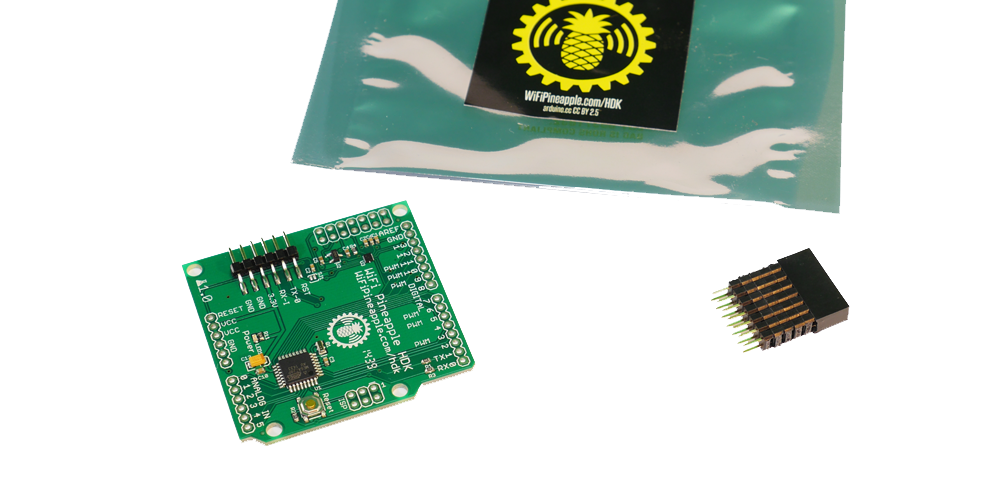
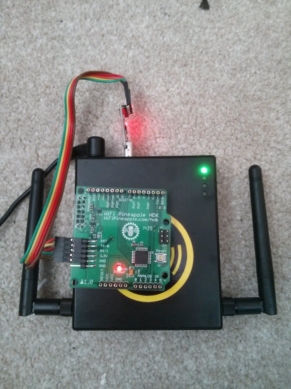

# Getting Started with the HDK



## Things you will need

1. The HDK
2. A Wifi Pineapple
3. A Soldering iron
4. Header Pins (Female and/or Male)
5. A USB to serial converter or arduino.
6. Wires (Optional, but very useful)

## Set up of the HDK in the Pineapple

The HDK talks to the Wifi pineapple via a bit-banged SPI interface, using on board gpios. These are not enabled by default. In order to enable the interface, type:

`/sbin/insmod spi-gpio-custom bus0=1,18,20,19,0,125000,21`

Once this command has been run, a new device /dev/spidev1.0 will be created. 

## Soldering the HDK

When soldered, the HDK will look something like this:



NB, the pinout for the HDK is compatible with Arduino Shields. If you want this, don't use the female headers shown.

## Programming the HDK

The easiest way to program the HDK is via a USB to serial converter (a arduino can be used, without the ATMEGA Chip). If you want to use the Arduino, look at the section "Uploading Using an Arduino Board" on this page: http://www.arduino.cc/en/Tutorial/ArduinoToBreadboard

Either way, you can use the Arduino IDE to compile and deploy the code. Set the IDE to Arduino Duemilanove, and the correct serial port.  


### Programming the HDK

### Testing.

This program will echo out anything recieved on the SPI interface (from the pineapple) on the serial port (using the serial to USB adapter). This is by no means the only way to test everything is working, but serial is really helpful for debugging.

You can obtain the original of this code from here: https://gist.github.com/chrismeyersfsu/3317769

The program will need to be uploaded to the HDK. Once complete, run the command:

`echo "Testing 1 2 3" >/dev/spidev1.0`

On the serial console of the HDK, the words "Testing 1 2 3" should appear.

```C
// Written by Nick Gammon
// February 2011
/**
 * Send arbitrary number of bits at whatever clock rate (tested at 500 KHZ and 500 HZ).
 * This script will capture the SPI bytes, when a '\n' is recieved it will then output
 * the captured byte stream via the serial.
 */

#include <SPI.h>

char buf [100];
volatile byte pos;
volatile boolean process_it;

void setup (void)
{
  Serial.begin (115200);   // debugging

  // have to send on master in, *slave out*
  pinMode(MISO, OUTPUT);
  
  // turn on SPI in slave mode
  SPCR |= _BV(SPE);
  
  // get ready for an interrupt 
  pos = 0;   // buffer empty
  process_it = false;

  // now turn on interrupts
  SPI.attachInterrupt();

}  // end of setup


// SPI interrupt routine
ISR (SPI_STC_vect)
{
byte c = SPDR;  // grab byte from SPI Data Register
  
  // add to buffer if room
  if (pos < sizeof buf)
    {
    buf [pos++] = c;
    
    // example: newline means time to process buffer
    if (c == '\n')
      process_it = true;
      
    }  // end of room available
}  // end of interrupt routine SPI_STC_vect

// main loop - wait for flag set in interrupt routine
void loop (void)
{
  if (process_it)
    {
    buf [pos] = 0;  
    Serial.println (buf);
    pos = 0;
    process_it = false;
    }  // end of flag set
    
}  // end of loop
```

## Additional Information + Useful Links

[Projects](hdk_projects.md)

https://randomcoderdude.wordpress.com/2013/08/15/spi-over-gpio-in-openwrt/
