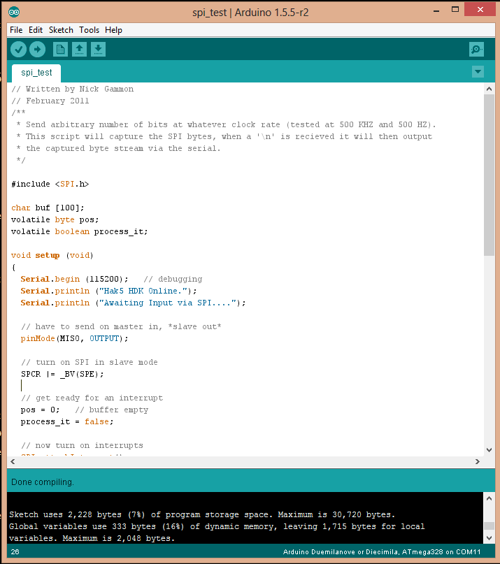

# Getting Started with the HDK

## Things You Will Need

1. The HDK
2. A WiFi Pineapple
3. A Soldering iron
4. Header Pins (Female and/or Male)
5. A USB to Serial Converter or Arduino Board.
6. Wires (Optional, but very useful)

## Set up of the HDK in the Pineapple

The HDK talks to the WiFi pineapple via a bit-banged SPI interface using on the board GPIO pins. These are not enabled by default so in order to enable the interface, on your Pineapple type:

`/sbin/insmod spi-gpio-custom bus0=1,18,20,19,0,125000,21`

Once this command has been run, a new device /dev/spidev1.0 will be created. 

## Soldering the HDK

When soldered, the HDK will look something like this:

Note: The pinout for the HDK is compatible with Arduino Shields. If you want to do this instead, **don't** use the female headers as shown.

## Programming the HDK

The easiest way to program the HDK is with a USB to Serial Converter (an Arduino can be used, without the ATmega Chip). If you want to use the Arduino, look at the section "Uploading Using an Arduino Board" on [this](http://www.arduino.cc/en/Tutorial/ArduinoToBreadboard) page.

Either way, you can use the Arduino IDE to compile and deploy the code. Set the IDE to Arduino Duemilanove, and the correct serial port.  

### Testing

This program will echo out anything recieved on the SPI interface (from the Pineapple) on the Serial Port (using the Serial to USB adapter). This is by no means the only way of ensuring that everything is working, but Serial is really helpful for debugging.

The code that was used above can be found [here](spi.ino). Thanks to [Nick Gammon](https://gist.github.com/chrismeyersfsu/3317769).

The program now needs to be uploaded to the HDK. Once complete, run the command:

`echo "Testing 1 2 3" >/dev/spidev1.0`

On the serial console of the HDK, the you should see the words "Testing 1 2 3" appear.

## Additional Information

+ [Projects](hdk_projects.md)

+ https://randomcoderdude.wordpress.com/2013/08/15/spi-over-gpio-in-openwrt/